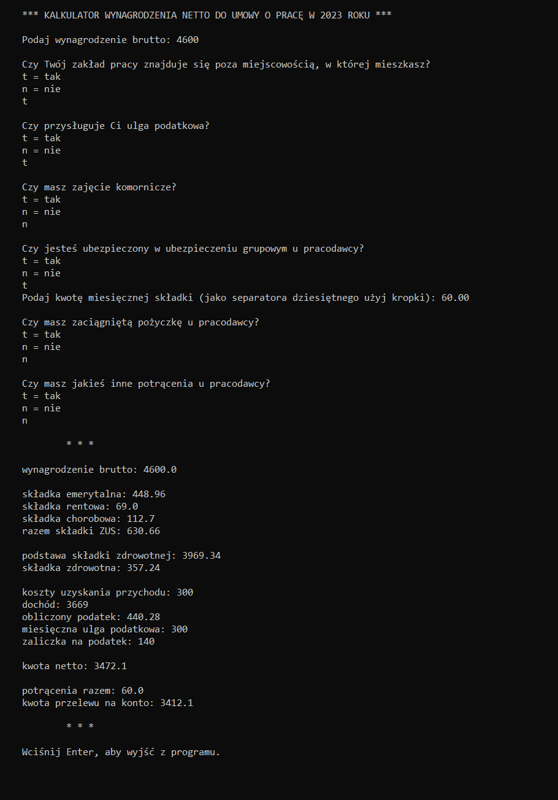

# Kalkulator wynagrodzenia netto do umowy o pracę w 2023 roku

### Opis programu
Kalkulator pobiera od użytkownika wynagrodzenie brutto oraz informację na temat kosztów uzyskania przychodu, ulgi podatkowej oraz potrąceń. Na tej podstawie wylicza wynagrodzenie netto oraz kwotę przelewu na konto.

### Przykładowe wyliczenie:

### Wymagania:
- zainstalowany Python

### Instalacja kalkulatora:
- pobranie repozytorium 
- uruchomienie pliku main.py
